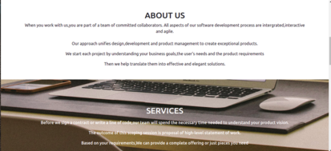
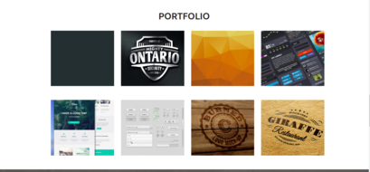
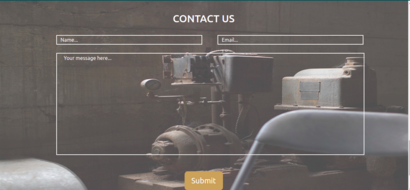

# Delani Studio

#### Created By Carlos Kipkoech on 14 Sep 2021
## Description
 | Delani Studio at Moringa School Prep Module. A landing page for a fictional studio.
## Setup Requirements
* Git
* Web-browser or your choice
* Github

## Setup Installation
* Copy the github repository url
* Clone to your computer
* Double click the index.html to go live/start your live server
## Technologies Used
 The following languages have been used on this project:
 * HTML
 * CSS
 * Bootstrap
 * Javascript
 * jQuery

## Setup/Installation Requirements

* Live link to view the project <a href="https://DWN7777.github.io/delani-studio/">View Delani Studio</a>
## Some Screenshots






## Known Bugs
 So far so good there are no bugs related to this project 😎
## Support and contact details 🙂
To make a contribution to the code used or any suggestions you can click on the contact link and email me your suggestions.
* Email: Carlos.kipkoech77@gmail.com
* Phone: +254758837521
## License
MIT License
```
Copyright Ⓒ  2021 CARLOS KIPKOECH (CODEZILLA)

Permission is hereby granted, free of charge, to any person obtaining a copy
of this software and associated documentation files (the "Software"), to deal
in the Software without restriction, including without limitation the rights
to use, copy, modify, merge, publish, distribute, sublicense, and/or sell
copies of the Software, and to permit persons to whom the Software is
furnished to do so, subject to the following conditions:

The above copyright notice and this permission notice shall be included in all
copies or substantial portions of the Software.

THE SOFTWARE IS PROVIDED "AS IS", WITHOUT WARRANTY OF ANY KIND, EXPRESS OR
IMPLIED, INCLUDING BUT NOT LIMITED TO THE WARRANTIES OF MERCHANTABILITY,
FITNESS FOR A PARTICULAR PURPOSE AND NONINFRINGEMENT. IN NO EVENT SHALL THE
AUTHORS OR COPYRIGHT HOLDERS BE LIABLE FOR ANY CLAIM, DAMAGES OR OTHER
LIABILITY, WHETHER IN AN ACTION OF CONTRACT, TORT OR OTHERWISE, ARISING FROM,
OUT OF OR IN CONNECTION WITH THE SOFTWARE OR THE USE OR OTHER DEALINGS IN THE
SOFTWARE.
Copyright Ⓒ  2021 CARLOS KIPKOECH
```
## Acknowledgments

* I must thank Moringa School for teaching me how to write code 
* Team mates,Technical Mentors, internet people for suggestions and unblocking while working 


